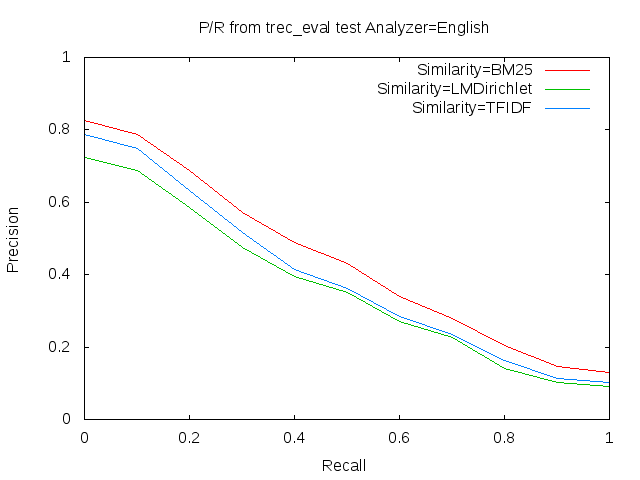

# Information Retreival & Web Search Assignment 1: Apache Lucene Search Engine and Cranfield Data

Here is a search engine implementation of the Apache Lucene Library (written in Java). Implementation includes parsing of `Cranfield 1400-file` database and `Cran 225-queries`,  indexing of Cranfield files and  searching queries using indexes created. P/R graph is generated for result found.

- Maven is used to managing the project dependencies and classpath of the project
- Basic Apache Lucene APIs are used. [ `lucene-core`, `lucene-analyzers-common`, `lucene-queryparser` ]
- Trec_eval is used to test the scores of created search engine with graded score judgements provided.


## Getting Started

Given instructions will help to get a copy of the project up and running on a local machine or cloud machine for development and testing purposes.


### Prerequisites
Things needed to install the application and test results.
```
Unix OS or Windows (Eclipse IDE)
Maven 3.8.0
JDK 11
GCC
Lucene 8.4.1
Trec_eval 9.0.7
Gnuplot
```

### Usage : Building, Compiling, Creating the Index, Querying and using Trec-eval to compare scores.
Project contains directories:
- `LuceneSearch` - parsing, Indexing and searching are done here.
- `trec_eval-9.0.7` - trec_eval executable to test score.
- `plot` - gnuplot for Precision and recall graph.


Steps to Follow:
1. Clone this repository to designated directory.

2. Using a terminal - change current directory to the `LuceneSearch` directory, where pom.xml is available.

3. Clean Project, Build and compile
```bash
mvn clean
mvn package
```

4. Execute Jar file generated in target directory.
```bash
java -cp target/*.jar
```

5. Copy result files to trec_eval `searchResult` directory
```bash
cp -r searchResult ../trec_eval-9.0.7/
```

6. Change directory to `trec_eval-9.0.7`, make trec_eval and Compare results available.
```bash
cd ../trec_eval-9.0.7/
make
./trec_eval -m map test/QRelsCorrectedforTRECeval searchResult/{any-result-file.txt}
```
6. Plot P/R graph for different similarity( using result files ).
```bash
gnuplot test.gnuplot
```
Result:


### Another Way - A quick way!!
For ease of running project script is available which will do every tasks just by running it - `run_script.sh`

```bash
#Remove all
rm -rf trec_eval-9.0.7/searchResult/*
rm -rf LuceneSearch/searchResult/*

echo "<<< Running script... >>"
cd LuceneSearch/
mvn package
java -jar target/*.jar

echo "Copying result files to trec_eval..."
cp -r searchResult ../trec_eval-9.0.7/

echo "Running trec_eval..."
cd ../trec_eval-9.0.7/

FILES=searchResult/*
for f in $FILES
do
  echo "./trec_eval -m map test/QRelsCorrectedforTRECeval" $f
  ./trec_eval -m map test/QRelsCorrectedforTRECeval $f
  echo " "
done
```
